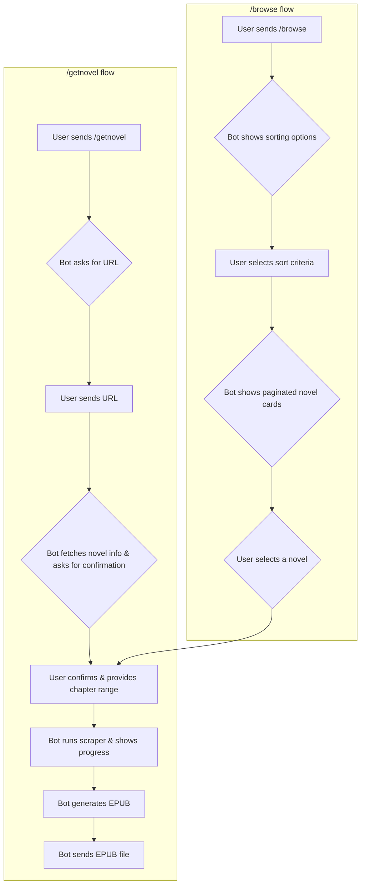

# Telegram Novel Scraper Bot

This project aims to create a Telegram bot that leverages existing Python web scraping scripts to fetch novels from specified URLs and convert them into EPUB format for easy reading.

## 1. Features

*   **Interactive Novel Download (`/getnovel`):** A guided, multi-step process to download novels.
    *   **URL Submission:** Simply provide the URL of the novel's main page.
    *   **Pre-Download Confirmation:** Before downloading, the bot displays the novel's cover, title, author, and total chapters for you to confirm.
    *   **Flexible Chapter Selection:** Choose to download all chapters at once or specify a custom range (e.g., chapters 10 to 50).
    *   **Live Progress Updates:** The bot edits a single message to show you the real-time progress of the download and EPUB generation process.

*   **Advanced Novel Discovery (`/browse`):** A powerful tool to find new novels.
    *   **Multiple Sorting Criteria:** Browse novels sorted by "Overall Ranking", "Most Read", or "Most Reviews".
    *   **Paginated Card View:** Novels are displayed one by one in a card-style menu with their cover image and details.
    *   **Easy Navigation:** Use "Next" and "Previous" buttons to navigate through the ranked lists.
    *   **Direct Download:** Select a novel directly from the browse menu to start the download process.

*   **Robust and User-Friendly:**
    *   **Command Menu:** All primary commands are easily accessible through the bot's command menu in Telegram.
    *   **Local Image Caching:** Cover images are downloaded locally by the bot to ensure they always load correctly and quickly.
    *   **Error Handling:** The bot provides clear feedback if a scraper fails or an error occurs.

## 2. Project Pipeline

The process from a user interacting with the bot to receiving their novel is now more interactive:



## 2. Proposed Tech Stack

The following technologies are proposed for building and deploying the Telegram bot:

*   **Telegram Bot Framework:** `python-telegram-bot` (Python library for interacting with the Telegram Bot API).
*   **Web Scraping:** Python (`requests` for HTTP requests, `BeautifulSoup4` for HTML parsing) - *Existing scripts already utilize these.*
*   **EPUB Generation:** Python (`EbookLib`) - *Existing scripts already utilize this.*
*   **Language:** Python 3.x
*   **Dependency Management:** `pip` with `requirements.txt`
*   **Deployment:**
    *   **Containerization:** Docker (for creating a portable and consistent environment).
    *   **Hosting:**
        *   **Free Tier Option:** Heroku (offers a free tier for hobby projects, though with limitations such as dyno sleeping after 30 minutes of inactivity and limited monthly dyno hours. This might require a "pinging" service to keep the bot alive for continuous operation).
        *   **Paid Options:** AWS EC2, Google Cloud Run, or a private VPS (Virtual Private Server) for more robust and continuous operation.

### Caching Strategy for Cloud Deployment

On many cloud platforms, the local file system is ephemeral, meaning downloaded chapters would be lost between bot invocations or container restarts. To implement persistent caching and minimize re-downloads, a cloud object storage solution is recommended:

*   **Cloud Object Storage:** Services like AWS S3, Google Cloud Storage, or Azure Blob Storage can be used.
    *   **Mechanism:** Instead of saving chapters to the local disk, `novel_scraper.py` would upload downloaded chapters, metadata, and cover images directly to a designated bucket in the chosen cloud storage. Before downloading, it would check if the chapter already exists in the cloud storage. `epub_generator.py` would then retrieve these files from cloud storage to compile the EPUB.
    *   **Benefits:** Highly scalable, durable, and cost-effective for storing large amounts of data. Many providers offer free tiers for object storage up to certain limits.
    *   **Implementation Note:** This approach requires modifications to `novel_scraper.py` and `epub_generator.py` to integrate with the respective cloud storage API (e.g., using `boto3` for AWS S3 or `google-cloud-storage` for GCS).

## 3. Project Requirements

### Functional Requirements

*   **Novel Request:** Users must be able to request a novel by providing its main URL.
*   **Chapter Selection:** Users should have the option to specify a range of chapters (start and end chapter) to download. If only one chapter is desired, the start and end chapter can be the same. If no chapters are specified, all available chapters will be downloaded by default.
*   **Content Scraping:** The bot must successfully scrape novel text and metadata (title, author, cover image) from the provided URL.
*   **EPUB Conversion:** The scraped content must be accurately converted into a standard EPUB format.
*   **File Delivery:** The generated EPUB file must be sent back to the requesting user via Telegram.
*   **Error Notifications:** The bot must provide clear error messages to the user if scraping or EPUB generation fails.
*   **Progress Updates:** The bot should provide periodic updates to the user on the status of the scraping and EPUB generation process (e.g., "Scraping chapter X of Y...", "Generating EPUB...").

### Non-Functional Requirements

*   **Scalability:** The bot should be designed to handle multiple concurrent novel download requests without significant performance degradation.
*   **Reliability:** The system should be robust, with comprehensive error handling and retry mechanisms for network issues or scraping failures.
*   **Security:** User inputs should be handled securely, and interactions with external websites should be performed responsibly (e.g., respecting `robots.txt`, implementing delays between requests).
*   **Maintainability:** The codebase should be well-structured, modular, and documented to facilitate future updates and debugging.
*   **Performance:** Scraping and EPUB generation should be optimized to minimize the waiting time for the user.
*   **Resource Management:** Efficient use of server resources (CPU, memory, disk space) is crucial, especially for temporary files.

## 4. Setup Instructions

To set up and run the Telegram Novel Scraper Bot, follow these steps:

### Prerequisites

*   Python 3.8+
*   `pip` (Python package installer)
*   A Telegram Bot Token (obtained from BotFather)

### Local Setup

1.  **Clone the repository:**
    ```bash
    git clone https://github.com/your-repo/telegram-novel-scraper-bot.git
    cd telegram-novel-scraper-bot
    ```
    *(Note: Replace `https://github.com/your-repo/telegram-novel-scraper-bot.git` with the actual repository URL once available.)*

2.  **Create a virtual environment (recommended):**
    ```bash
    python3 -m venv venv
    source venv/bin/activate  # On Windows: `venv\Scripts\activate`
    ```

3.  **Install dependencies:**
    ```bash
    pip install -r requirements.txt
    ```
    *(Note: A `requirements.txt` file will need to be created containing `python-telegram-bot`, `requests`, `beautifulsoup4`, `EbookLib`, and potentially cloud storage SDKs like `boto3` or `google-cloud-storage`.)*

4.  **Configure your Telegram Bot Token:**
    Create a `.env` file in the root directory of the project and add your Telegram Bot Token:
    ```
    TELEGRAM_BOT_TOKEN=YOUR_TELEGRAM_BOT_TOKEN_HERE
    ```
    *(Note: A library like `python-dotenv` will be needed to load this environment variable.)*

5.  **Run the bot:**
    ```bash
    python3 bot.py
    ```
    *(Note: A `bot.py` file will need to be created to implement the Telegram bot logic.)*

### Docker Setup (for deployment)

1.  **Build the Docker image:**
    ```bash
    docker build -t telegram-novel-bot .
    ```
    *(Note: A `Dockerfile` will need to be created.)*

2.  **Run the Docker container:**
    ```bash
    docker run -d --name novel-bot -e TELEGRAM_BOT_TOKEN=YOUR_TELEGRAM_BOT_TOKEN_HERE telegram-novel-bot
    ```
This `README.md` provides a comprehensive overview of the project, its technical aspects, and how to set it up.
